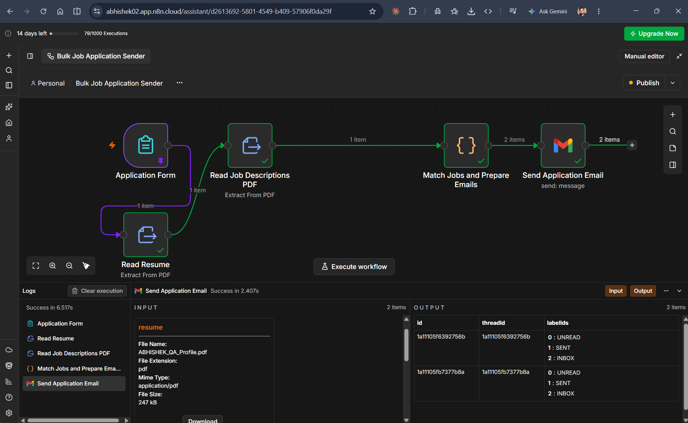

# Bulk Job Application Sender

## Workflow Architecture

---

## Execution Overview

---

## Project Description

A powerful n8n workflow that automates the job-application process by:

- accepting a JD PDF and a candidate resume PDF through a form,
- extracting text from both files,
- matching the candidate profile against job requirements,
- filtering out unsuitable roles using hard/soft blocker logic,
- and sending recruiter emails automatically through Gmail.

This project is designed for QA and automation-focused job seekers who want to apply to multiple roles faster while keeping the process controlled and customizable.

---

## Overview

This workflow is built in n8n and acts as a smart bulk outreach system for recruitment.

The idea is simple:

1. The user submits a PDF with multiple job descriptions.
2. The user uploads their resume PDF.
3. The workflow extracts text from both documents.
4. Matching logic compares the resume and JD keywords.
5. The candidate's experience, skills, and role fit are checked.
6. Suitable jobs are shortlisted.
7. A recruiter email is generated and sent using Gmail.

The workflow supports both:

- Preview mode: sends all emails to the candidate's inbox for testing
- Live mode: sends emails to recruiters

---

## How It Works: Step-by-Step

### 1. Application Form (Entry Point)
Users upload two PDF documents and fill in their profile:
- Job openings PDF (contains multiple job descriptions with recruiter emails)
- Resume PDF (candidate's profile)
- Mode selection (Preview or Live)
- Candidate details (email, name, phone, years of experience)
- Email subject and body template

### 2. Extract Resume Text
The resume PDF is parsed and text is extracted, normalized, and converted to lowercase for matching.

### 3. Extract Job Descriptions
The JD PDF is parsed to identify individual job blocks. Each job block contains:
- Location
- Company
- Job title/role
- Required experience
- Recruiter email address

### 4. Smart Job Matching Algorithm
This is where the intelligent filtering happens:

**Experience Fit Check:**
- Compares candidate experience with job requirements
- Allows ±1 year tolerance

**Hard Blockers (Auto-reject):**
If the job requires these technologies and your resume doesn't mention them:
- Salesforce, SAP, Finacle
- ETL / Data Warehouse / Snowflake / Databricks
- Bluetooth, Wi-Fi, 5G, Telecom
- AR/VR
- LoadRunner/NeoLoad
- TOSCA
- Mainframe
- Kafka

**Soft Blockers (Secondary Filter):**
Rejected only if the job doesn't mention Playwright or Cypress:
- Java, C#, Selenium, Python, JMeter, Appium

**Skill Matching:**
The job and resume must share at least 3 skills from this list:
- Playwright, Cypress
- API testing, Manual testing
- Functional, Regression, Sanity/Smoke testing
- Integration, E2E testing
- Automation
- AI/LLM testing
- JavaScript/TypeScript
- CI/CD (Jenkins, GitHub Actions)
- Agile/Scrum
- Jira/Azure DevOps
- QA leadership
- Defect management

**Recruiter Deduplication:**
- Same recruiter gets only one email per run
- Hard-coded exclusions: swtestingstudio@gmail.com, your own email

### 5. Send Application Emails
Matched jobs trigger Gmail sends with:
- Resume attached as PDF
- Your full name as sender name
- Subject and body from form (one template for all recruiters)

In Preview mode: emails go to your inbox with `[PREVIEW to recruiter@...]` prefix
In Live mode: emails go directly to recruiters

---

## Configuration Details

### Email Provider
**Gmail with OAuth2 Authentication**
- Uses n8n Gmail node v2.2
- Requires Gmail OAuth2 credentials configured in n8n
- Emails sent from your configured Gmail account
- Sender name: your full name (from form)
- Attachments: resume PDF

### n8n Version
Designed for recent n8n versions using:
- Form Trigger v2.6
- Extract from File v1.1
- Code v2 (JavaScript matching logic)
- Gmail v2.2

No strict version lock required; any recent n8n instance works (including n8n Cloud).

### Environment Variables
**None required.** All configuration happens through:
- Gmail OAuth2 credential connection
- Form fields
- Workflow configuration

---

## Execution Performance

### Typical Run Timing
Based on recent successful runs:
- **Initial extraction + matching:** ~4 seconds
- **Per matched email sent:** ~1 second additional
- **Example:** 20–30 matches = 20–40 seconds total

### Email Volume
- **Personal Gmail:** ~500 emails/day limit
- **Google Workspace:** ~2,000 emails/day limit
- **Per run:** No cap (limited by unique recruiter addresses in PDF)
- **Minimum:** 0 (if no matches, run succeeds silently with no emails sent)

---

## Key Features

✅ **Automated PDF Parsing** - Extracts text from both resume and job descriptions
✅ **Intelligent Matching** - Keyword-based filtering with hard and soft blockers
✅ **Experience Validation** - Checks candidate years against job requirements (±1 year tolerance)
✅ **Skill Analysis** - Requires minimum 3 matching skills between resume and JD
✅ **Preview Mode** - Test emails before going live to recruiters
✅ **Bulk Sending** - One form submission, multiple recruiter emails
✅ **No Duplicates** - Each recruiter gets only one email per run
✅ **Customizable Templates** - Edit email subject and body before sending

---

## Input and Output

### Inputs
- Job openings PDF (multiple job postings)
- Resume PDF
- Candidate email, name, phone, experience years
- Email subject and body (customizable)
- Mode selection (Preview/Live)

### Outputs
- Emails sent to recruiters (or your inbox in Preview mode)
- Resume attached to each email
- One email per unique matched recruiter
- Run history visible in n8n logs

---

## Limitations and Edge Cases

1. **PDF Layout Dependency:** JD PDF must follow a consistent format. Each job needs:
   - At least 3 lines of content
   - Email address on a separate line to mark job boundary

2. **Text Extraction Only:** 
   - No OCR support
   - Scanned/image-only PDFs won't work
   - Ligature characters (fi, fl) are auto-corrected

3. **Fixed Keyword Lists:**
   - Tuned for QA/automation roles
   - Other profiles need code edits in "Match Jobs and Prepare Emails" node

4. **No Personalization:**
   - Same email body/subject for all recruiters
   - Company, role, location guessed from line position (may be inaccurate with unusual layouts)

5. **No Memory Between Runs:**
   - Submitting same JD twice in Live mode emails same recruiters again
   - No tracking of previously contacted recruiters

6. **No Rejection Logging:**
   - Rejected jobs are not saved or reported
   - Only successful matches visible in n8n run history

---

## Security and Data Handling

This workflow:
- ✅ Reads PDF files only during form submission
- ✅ Extracts text locally (no external API calls for PDF parsing)
- ✅ Uses your Gmail account for sending (you control the credential)
- ✅ Attaches your resume as specified
- ✅ No data is stored between runs

### Recommended for Production:
- Use a dedicated Gmail account or Google Workspace account
- Validate JD PDF format before large-scale runs
- Review extracted recruiter emails in n8n logs before Live mode
- Start with Preview mode to verify email content and recipients

---

## Example Use Case

**Scenario:** A QA engineer is looking for a Lead QA Engineer role with 4+ years of automation experience.

**Inputs:**
- PDF with 30 job listings from various companies
- Resume highlighting: Playwright, Cypress, API testing, Agile, CI/CD, QA leadership

**Workflow Output:**
- Identifies jobs requiring 4–5 years experience ✅
- Filters out roles requiring SAP, Salesforce, or Mainframe ✅
- Matches jobs with 3+ of candidate's skills ✅
- Sends personalized emails to 8–12 recruiters with resume attached ✅
- Preview mode lets candidate review emails before sending to recruiters ✅

---

## Best Practices

1. **PDF Format:** Use clean, well-structured JD PDFs with consistent layout
2. **Preview First:** Always test with Preview mode before Live
3. **Resume Quality:** Ensure resume text is clear and contains relevant keywords
4. **Gmail Setup:** Use a business Gmail account for larger sending volumes
5. **Keyword Tuning:** For non-QA roles, edit the skill lists in the Code node
6. **Monitor Sends:** Check n8n run history for any failed emails
7. **Rate Limiting:** Space out multiple runs to avoid Gmail throttling

---

## Recommended Enhancements

Future improvements could include:

- 🔄 **LLM-based matching** - Use OpenAI to understand job requirements semantically
- 📊 **CSV export** - Export matched jobs for tracking
- 📧 **Response tracking** - Track recruiter replies and bounce-backs
- 🔁 **Auto follow-up** - Send reminder emails after N days
- ✔️ **Pre-validation** - Check PDF format before processing
- 🎯 **Email templates** - Different templates for different role categories
- 📋 **Rejection log** - Save reasons why jobs were rejected

---

## Workflow JSON

The complete workflow configuration is available in: `Bulk Job Application Apply.json`

To import this workflow:
1. Copy the JSON content
2. In n8n, create a new workflow
3. Click "Menu" → "Import from file"
4. Paste the JSON and click "Import"
5. Set up your Gmail OAuth2 credential
6. Publish and run

---

## Project Status

✅ **Fully Functional** - Tested in production with successful email sends
✅ **Portfolio Ready** - Great showcase of n8n capabilities
✅ **Automation Example** - Demonstrates PDF parsing, logic, and email integration

Ideal for:
- Recruitment automation
- Job seeker portfolio projects
- n8n workflow demonstrations
- Learning automation best practices

---

## License

This project is shared as a workflow demonstrator for personal and portfolio use.

---

## Author

**Abhishek K M**
- GitHub: https://github.com/Abhishek-Githu-home
- LinkedIn: https://www.linkedin.com/in/abhishek-k-m-1723a023b/

Created as a personal automation project to streamline bulk job applications using n8n.
